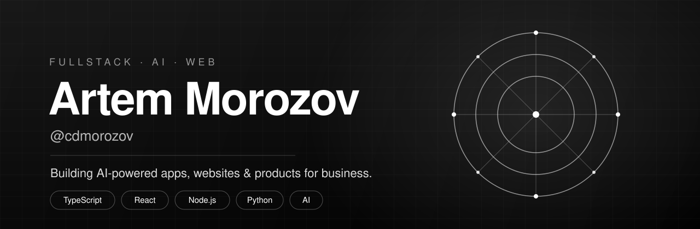
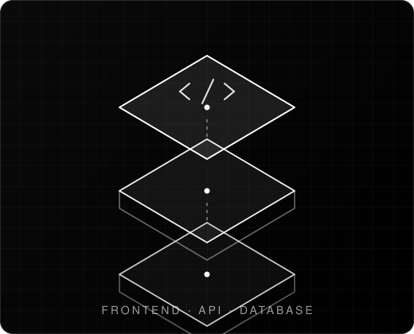
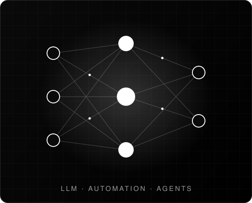

<!-- HERO -->

  

 

<!-- SECTION 1 — image left, text right -->

### Product engineering

You have a problem. I figure out what to build and ship it. One person
handles the interface, the API, and the database, so you don't need to
coordinate a team.

**Frontend** · React · TypeScript · Next.js 
**Backend** · Node.js · Python · PostgreSQL

 
 

<!-- SECTION 2 — text left, image right -->

### AI-powered solutions

Most AI integrations are demos. I build things that run in production:
chatbots that handle real customer questions, automations that kill
repetitive work, assistants your team actually uses.

**LLM apps** · Automation · Agents · Telegram bots

 
 

<!-- CONNECT -->
<h2 align="center">Let's connect</h2>

📩 Open to freelance. You describe the problem, I ship the product.

